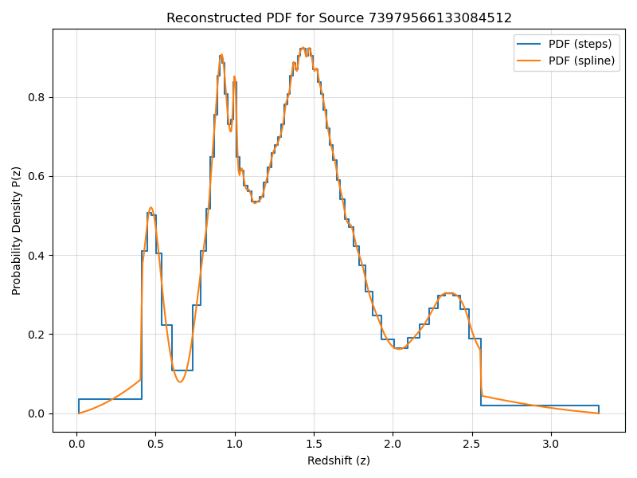
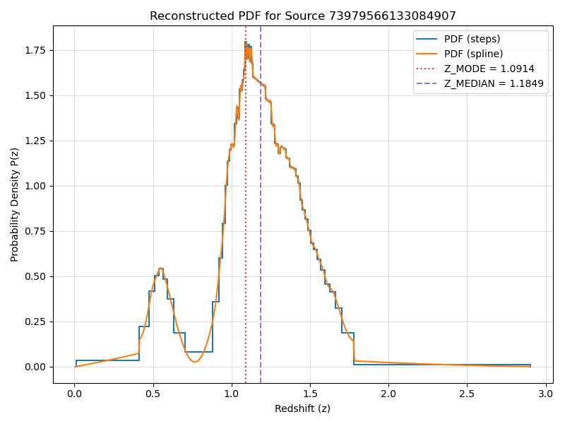
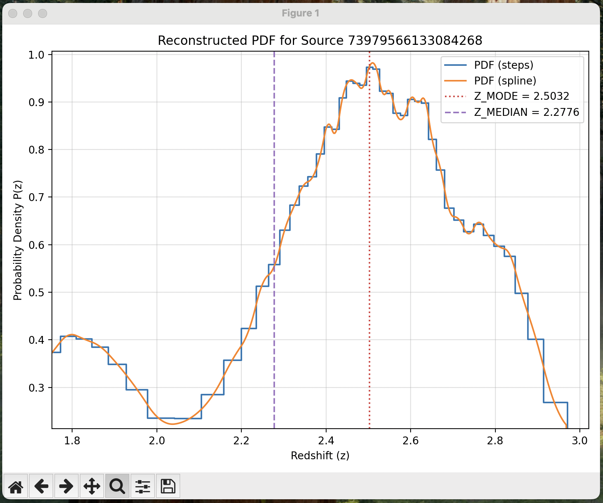

# ColdPress

**A toolkit for the efficient compression and analysis of redshift PDFs.**

The **coldpress** Python package implements the *ColdPress* algorithm for fast and efficient compression of probability distribution functions (PDFs) into a compact, fixed-size encoding. This is ideal for storing millions of redshift PDFs in large astronomical databases.

> [!NOTE]
> The details of the algorithm and a performance comparison with alternative methods are presented in [this research note](https://iopscience.iop.org/article/10.3847/2515-5172/adeca6).

**coldpress** computes the cumulative distribution function (CDF) from the input data, which must be provided in one of three formats:

1.  **Binned PDF:** An array containing the probabilities *P<sub>i</sub>* for the true redshift being inside the bin *i* centered at *z<sub>i</sub>*. The bins must be evenly spaced from *z*<sub>min</sub> to *z*<sub>max</sub>. The CDF is evaluated at the ending edge of each bin as the cumulative sum of the *P<sub>i</sub>*. This is the fastest, but also less accurate method. Not widely used.
2. **Grid of *P*(*z*)**: An array containing the probability density *P*(*z*) measured in a grid of redshifts *z<sub>i</sub>*. This is the typical output of most SED-fitting photo-z codes. The CDF is evaluated by numeric integration of *P*(*z*), which is linearly interpolated between the points of the grid.
3. **PDF from random samples:** An array of random redshift values drawn from the underlying probability distribution *P(z)*. This is the raw output of any software that uses Monte Carlo to generate probability distributions. The CDF is computed as the fraction of samples below a given redshift.

Regardless of the input format, the *ColdPress* algorithm computes the redshifts *z*<sub>*i*</sub> that correspond to the quantiles *q*<sub>*i*</sub> of the CDF and encodes the differences *∆*<sub>*i*</sub> = *z*<sub>*i*</sub> - *z*<sub>*i*-1</sub> using (most often) a single byte.

Once the PDFs are stored in the **coldpress** format, **coldpress** can perform multiple tasks with them, including resampling to a new grid, visualization, and measurement of statistics (mode, mean, confidence intervals, etc.).

## Installation

The **coldpress** package requires Python 3.8 or newer. The main dependencies are **numpy** and **astropy**. **matplotlib** is required for the `plot` command, and **scipy** is required for the `spline` interpolation method.

You can install **coldpress** directly from GitHub with `pip`. 
To install the latest stable version, use:

```bash
pip install https://github.com/ahc-photoz/coldpress/releases/latest/download/coldpress-latest.tar.gz
```
To install the latest update from the development branch, use:

```bash
pip install https://github.com/ahc-photoz/coldpress.git@develop
```

## Usage

You can interact with **coldpress** in two main ways:

1.  **As a Python Module:** For maximum versatility, `import coldpress` directly into your Python scripts to access its API.

2.  **As a Command-Line Tool:** For working with FITS tables, the `coldpress` command provides a powerful interface.

    To see the main help message and available commands, run:
    
    ```bash
    coldpress --help
    ```
    To see the specific options for any command, such as `encode`, run:
    
    ```bash
    coldpress encode --help
    ```

## Quick Start

This section demonstrates a typical workflow using the `coldpress` command-line tool. We will inspect a FITS table, compress the PDFs it contains, measure key statistics, and plot the results.

### The Data

We will use a sample of 1,000 redshift PDFs from the Hyper Suprime-Cam Subaru Strategic Program (HSC-SSP) Public Data Release 3 ([Aihara et al. 2022](https://ui.adsabs.harvard.edu/abs/2022PASJ...74..247A/abstract)). The PDFs were generated with the **Mizuki** photometric redshift code ([Tanaka 2015](https://ui.adsabs.harvard.edu/abs/2015ApJ...801...20T/abstract)).

> [!NOTE]
> The full HSC-SSP PDR3 photo-z catalogs are available at the [official data release site](https://hsc-release.mtk.nao.ac.jp/doc/index.php/photometric-redshifts__pdr3/).

For this example, you can download a small sample file directly from this repository:

```bash
wget https://raw.githubusercontent.com/ahc-photoz/coldpress/main/examples/hsc_sample.fits
```

### 1. Inspect the File with `coldpress info`

First, view the contents of the FITS table to understand its structure:

```bash
coldpress info hsc_sample.fits 
```
```
Inspecting 'hsc_sample.fits'...
HDU 1 (Name: 'DATA')
  Rows: 1000
  Columns: 2
  --- Column Details ---
    - Name: ID                   Format: 1K
    - Name: PDF                  Format: 701E
```
The `PDF` column contains the probability density *P(z)* sampled in 701 bins. To find the corresponding redshift for each bin, we inspect the FITS header:

```bash
coldpress info hsc_sample.fits --header | grep -E 'Z_MIN|Z_MAX|DELTA_Z'
```
```
Z_MIN   =                   0. / Redshift of the first bin
Z_MAX   =                   7. / Redshift of the last bin
DELTA_Z =                 0.01 / Redshift bin width
```
This shows that the `PDF` column samples *P(z)* from z=0 to z=7 in steps of 0.01.

### 2. Compress PDFs with `coldpress encode`
To compress the PDFs, we provide the input and output filenames, the redshift range, and the name of the column containing the PDFs.

```bash
coldpress encode hsc_sample.fits hsc_sample_encoded.fits --zmin 0 --zmax 7 --density PDF
```
```
Opening input file: hsc_sample.fits
Finding optimal number of quantiles for each source...
1000 PDFs cold-pressed in 0.945312 CPU seconds
Excluding column 'PDF' from output FITS table.
Writing compressed data to: hsc_sample_encoded.fits
Done.
```

> [!IMPORTANT]
> The `--density PDF` option tells **coldpress** that the `PDF` column contains P(z) sampled in a grid. If your column contains integrated probability in bins, or random samples, you should use `--binned` or `--samples` instead.

By default, the original `PDF` column is removed. To keep it, add the `--keep-orig` flag. The compressed data is saved in a new column named `coldpress_PDF`.

### 3. Measure Statistics with `coldpress measure`
While a full PDF is comprehensive, point estimates like the mode or median are often more convenient. **coldpress** can measure many common statistics directly from the compressed data.

To see a list of all available quantities and their descriptions, run:

```bash
coldpress measure --list-quantities 
```
To calculate a few key statistics and save them to a new file, run:

```bash
coldpress measure hsc_sample_encoded.fits hsc_sample_measured.fits --quantities Z_MEDIAN Z_MODE ODDS_MODE
```
```
Opening input file: hsc_sample_encoded.fits
Will compute: ODDS_MODE, Z_MEDIAN, Z_MODE
Calculating point estimates for 1000 valid sources...
Writing point estimates to: hsc_sample_measured.fits
Done.
```
> [!TIP]
> Use `--quantities ALL` to compute all available statistics at once.

### Visualizing the PDFs with `coldpress plot`

You can quickly visualize any PDF directly from its compressed representation using the `plot` command. 

To plot the first ten PDFs in the table as PNG files:

```bash
coldpress plot hsc_sample_encoded.fits --first 10 
```

To plot the PDF for a specific source, use the `--id` and `--idcol` flags:

```bash 
coldpress plot hsc_sample_encoded.fits --idcol ID --id 73979566133084512
```



> [!IMPORTANT]
> You don't need to decompress the PDFs into a new file before plotting. The `plot` command decodes them on the fly.

To reconstruct a continuous PDF from a discrete set of quantiles, **coldpress** must interpolate the CDF. It supports two methods:

* **Linear (`steps`):** A linear interpolation of the CDF results in a constant *P(z)* between quantiles, which is rendered as a step function.
* **Monotonic Cubic Spline (`spline`):** This produces a smooth *P(z)* curve while ensuring that P(z)<0 never happens and that the integrated probability for each inter-quantile interval is conserved.

By default, both interpolation methods are shown in the plots. You can choose to display only one using `--method steps` or `--method spline`.

You can also overplot any numerical quantity from the FITS table (such as the ones we just calculated with the `measure` command) as a vertical line using the `--quantities` flag followed by the relevant column names.

```bash
coldpress plot hsc_sample_measured.fits --quantities Z_MODE Z_MEDIAN --idcol ID --id 73979566133084907
```


> [!TIP] 
> Use `--format JPEG` or `--format PDF` to save the figures in JPEG or PDF format. Use `--outdir <DIRECTORY>` to specify a different output directory.

You can also open the plot in an interactive window using the `--interactive` flag. 

```bash
coldpress plot hsc_sample_measured.fits --quantities Z_MODE Z_MEDIAN --idcol ID --first 5 --interactive
```


> [!TIP] 
> Use the pan and zoom buttons in the interactive window to explore your PDFs in full detail!


### 5. Decompress PDFs with `coldpress decode`

For cases where you need the PDF in a standard binned format for other software, the `decode` command reconstructs the histogram on any grid you define.

For example, to reconstruct the PDFs using a grid with twice the redshift resolution (*z* steps of 0.005 instead of 0.1) using monotonic spline interpolation from *z*=0 to *z*=7 and stored in a column named PDF_highres:

```bash
coldpress decode hsc_sample_encoded.fits hsc_sample_decoded.fits --density PDF_highres --zmin 0 --zmax 7 --nvalues 1401 --method spline
```
> [!WARNING]
> If a decoded PDF has non-zero probability outside the range you specify, `coldpress` will raise a truncation error. Use the `--force-range` flag to allow truncation. 

## Contributing

We welcome all contributions and greatly appreciate your help. To get started, please see the guidelines below:

   * 🐛 **Bugs & ✨ Feature Requests:** Please open an issue to report a bug or discuss a new feature.

   * 👍 **Pull Requests:** We welcome pull requests for bug fixes, documentation, and new features. If you plan a larger contribution, please open an issue to discuss it first.

## Citation

If you use `coldpress` in your research, please acknowledge **coldpress** in your publications and cite the research note where **coldpress** is described:

> Hernán-Caballero, A. 2025, Res. Notes AAS, 9, 7, 170.
> doi:10.3847/2515-5172/adeca6


You can use the following BibTeX entry:

```bibtex
@ARTICLE{2025RNAAS...9..170H,
       author = {{Hern{\'a}n-Caballero}, Antonio},
        title = "{ColdPress: Efficient Quantile-based Compression of Photometric Redshift PDFs}",
      journal = {Research Notes of the American Astronomical Society},
     keywords = {Astronomy software, 1855},
         year = 2025,
        month = jul,
       volume = {9},
       number = {7},
          eid = {170},
        pages = {170},
          doi = {10.3847/2515-5172/adeca6},
       adsurl = {https://ui.adsabs.harvard.edu/abs/2025RNAAS...9..170H},
      adsnote = {Provided by the SAO/NASA Astrophysics Data System}
}
```

## License

**coldpress** is licensed under the GNU *Lesser* General Public License v3.0 (LGPLv3).

This license was chosen to allow seamless integration as a dependency in other software projects, while still encouraging contributions back to **coldpress** itself. For the full terms and conditions, please see the `COPYING` file.
